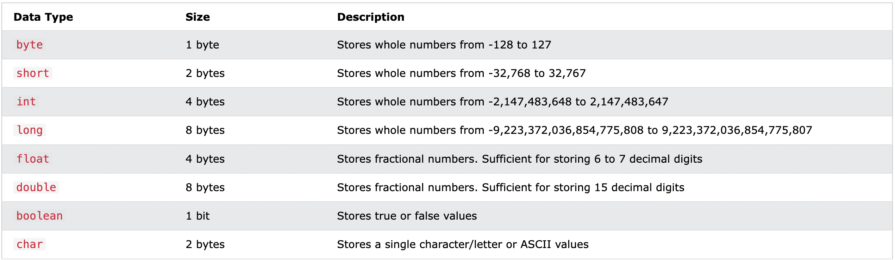

### _The first letter of .java file must be capitalized?_

There is no requirement in Java that the first letter of a .java file must be capitalized. The naming conventions for .java files are generally the same as for any other type of file, and the first letter can be either uppercase or lowercase.

However, it is common practice in Java to follow a naming convention called "CamelCase" for class names, where the first letter of each word in the name is capitalized. For example, a class name might be "MyClass" or "MyVeryLongClassName". This naming convention helps to make class names more readable and easier to distinguish from other identifiers.

It is also common practice to use all lowercase letters and underscores for the names of package names, such as "com.example.mypackage".

These conventions are not required by the Java language, but they are widely followed in the Java community to improve the readability and consistency of code.

### What is the variables in java

In Java, there are different types of variables, for example:

String - stores text, such as "Hello". String values are surrounded by double quotes
int - stores integers (whole numbers), without decimals, such as 123 or -123
float - stores floating point numbers, with decimals, such as 19.99 or -19.99
char - stores single characters, such as 'a' or 'B'. Char values are surrounded by single quotes
boolean - stores values with two states: true or false

### What's data type in java

```java
int myNum = 5;               // Integer (whole number)
float myFloatNum = 5.99f;    // Floating point number
char myLetter = 'D';         // Character
boolean myBool = true;       // Boolean
String myText = "Hello";     // String
```



### Final Variables

If you don't want others (or yourself) to overwrite existing values, use the final keyword (this will declare the variable as "final" or "constant", which means unchangeable and read-only):

```
final int myNum = 15;
myNum = 20; // will generate an error: cannot assign a value to a final variable
The output will still be 20
```

### Non-Primitive Data Types

Non-primitive data types are called reference types because they refer to objects.

The main difference between primitive and non-primitive data types are:

- Primitive types are predefined (already defined) in Java. Non-primitive types are created by the programmer and is not defined by Java (except for String).
- Non-primitive types can be used to call methods to perform certain operations, while primitive types cannot.
- A primitive type has always a value, while non-primitive types can be null.
- A primitive type starts with a lowercase letter, while non-primitive types starts with an uppercase letter.
- The size of a primitive type depends on the data type, while non-primitive types have all the same size.

#### Examples of non-primitive types are Strings, Arrays, Classes, Interface, etc. You will learn more about these in a later chapter.

### Method Overloading

With method overloading, multiple methods can have the same name with different parameters:
Instead of defining two methods that should do the same thing, it is better to overload one.

In the example below, we overload the plusMethod method to work for both int and double:

```java
static int plusMethod(int x, int y) {
  return x + y;
}

static double plusMethod(double x, double y) {
  return x + y;
}

public static void main(String[] args) {
  int myNum1 = plusMethod(8, 5);
  double myNum2 = plusMethod(4.3, 6.26);
  System.out.println("int: " + myNum1);
  System.out.println("double: " + myNum2);
}
```
